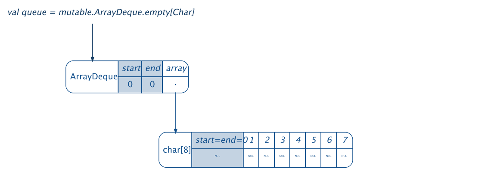

ArrayDeque
----------



To run the code:
```shell
sbt "~runMain Demo"
```


Prior discussion: 
https://contributors.scala-lang.org/t/using-circular-buffers-as-mutable-arraybuffer/454

SI-10167: https://issues.scala-lang.org/browse/SI-10167

ArrayDeque's (implemented using a growable circular buffers using modular arithmetic for indexing) are strictly better data structures than vanilla ArrayBuffers.

This improves on `java.util.ArrayDeque` by providing an O(1) `get(idx)` and also providing faster `insertAt(idx)` and `deleteAt(idx)` operations.

This implementation adds `O(1)` `append`, `prepend`, `removeHead`, `removeTail`, `get`, `update` and `clear` APIs. 

We also provide proof of concept replacement implementations of mutable data structures like stack, queues and buffers with ArrayDeque here.

Preliminary benchmarks prove that this data structure can suitably replace `mutable.ArrayBuffer`
```
===============[Insert lots of items]=================
  ArrayDeque:   956.76 ms
 ArrayBuffer:  2473.36 ms
===============[Drop some items from an head index]=================
  ArrayDeque:     1.25 ms
 ArrayBuffer:     7.65 ms
===============[Drop some items from a tail index]=================
  ArrayDeque:     0.28 ms
 ArrayBuffer:     2.54 ms
===============[Append lots of items one by one]=================
  ArrayDeque:  2222.13 ms
 ArrayBuffer:  3576.63 ms
===============[Prepend few items one by one]=================
  ArrayDeque:     1.33 ms
 ArrayBuffer:  8699.13 ms
===============[Prepend lots of items at once]=================
  ArrayDeque:   462.76 ms
 ArrayBuffer:  2124.02 ms
===============[Random indexing]=================
  ArrayDeque:    84.02 ms
 ArrayBuffer:    81.62 ms
===============[Insert items near head]=================
  ArrayDeque:  1429.52 ms
 ArrayBuffer:  2980.46 ms
===============[Reversal]=================
  ArrayDeque:   378.69 ms
 ArrayBuffer:   491.46 ms
===============[Insert items near tail]=================
  ArrayDeque:  2504.20 ms
 ArrayBuffer:  8588.98 ms
===============[Sliding]=================
  ArrayDeque:   157.25 ms
 ArrayBuffer:  1591.47 ms
===============[toArray]=================
  ArrayDeque:   181.07 ms
 ArrayBuffer:   194.55 ms
===============[Clear lots of items]=================
  ArrayDeque:    48.34 ms
 ArrayBuffer:    28.62 ms
```

To run benchmarks:
```shell
sbt "test/runMain scala.collection.mutable.ArrayDequeBenchmark"
```